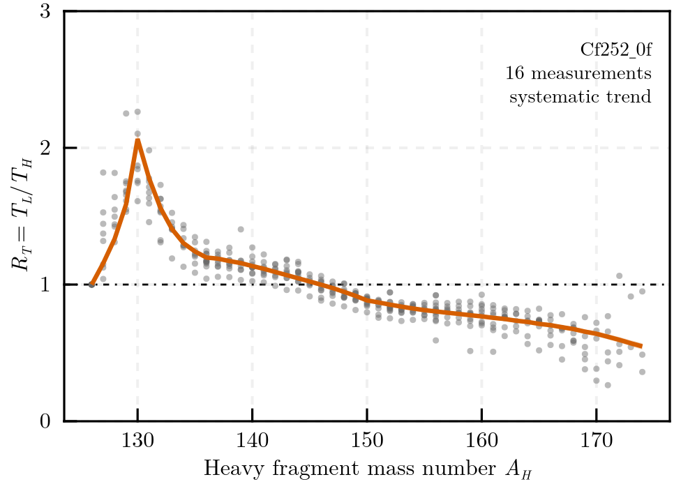
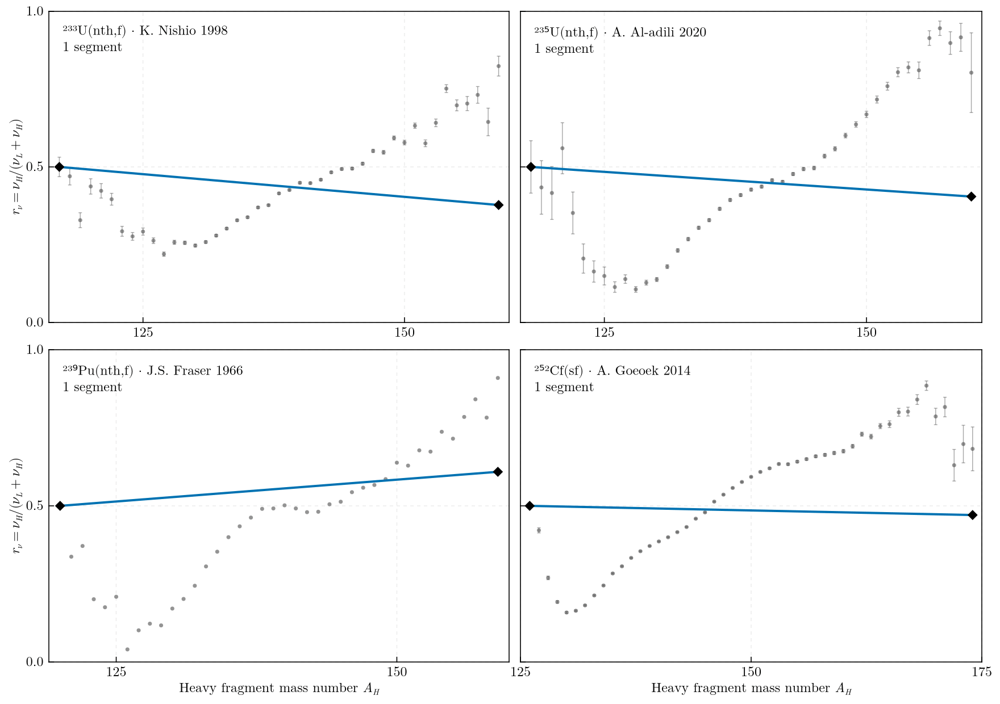
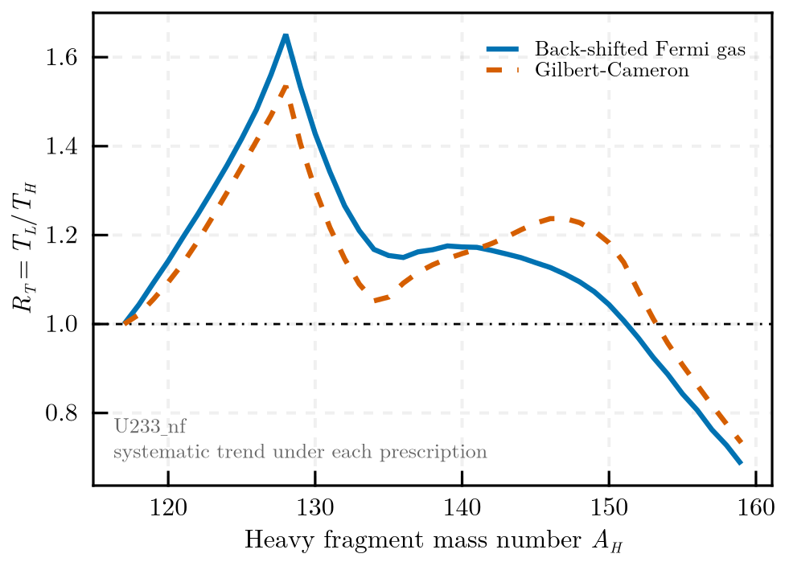
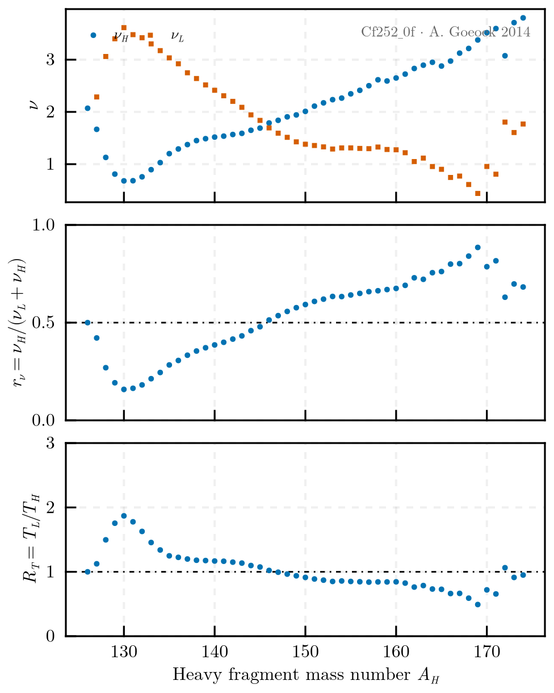
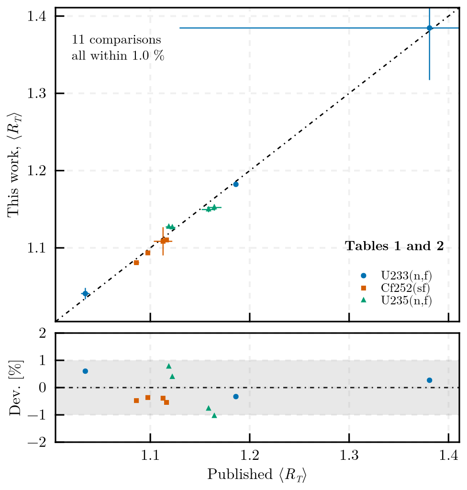

# FissionTemperatureRatio.jl

[](https://github.com/PaulGoG/FissionTemperatureRatio.jl/actions/workflows/CI.yml)
[](https://PaulGoG.github.io/FissionTemperatureRatio.jl/dev/)
[](https://julialang.org)
[](https://github.com/JuliaTesting/Aqua.jl)
[](https://github.com/aviatesk/JET.jl)
[](https://github.com/domluna/JuliaFormatter.jl)
[](LICENSE)

Extraction of the temperature ratio `R_T = T_L/T_H` of complementary fully accelerated fission
fragments from experimental prompt neutron multiplicity data, and its parameterization by joined
straight segments.

The method, its conventions and its equation numbering are those of A. Tudora and P. Gogita,
*Eur. Phys. J. A* **60**, 190 (2024),
[doi:10.1140/epja/s10050-024-01375-7](https://doi.org/10.1140/epja/s10050-024-01375-7), and this
package reproduces the results published there: the total average temperature ratios of its
Tables 1 and 2 come back to better than one per cent for 233-U(n,f), 252-Cf(sf) and 235-U(n,f).
The [validation status](#validation-status) below states exactly what has been checked against the
paper and what has not.

Experimental input — prompt neutron multiplicity `ν(A)` and fragment mass yields `Y(A)` — is
sourced from the IAEA EXFOR archive with
[ExforFissionData.jl](https://github.com/PaulGoG/ExforFissionData.jl), a companion package that
retrieves fission observables and writes them as tabulated files with a record of every dataset it
kept or excluded. This package reads those files; it does not query the archive itself.



The temperature ratio of 252-Cf(sf): every measurement held, in grey, and the systematic trend
through them with its uncertainty. Above the symmetric split the light fragment is the hotter of
the pair, and the ratio crosses unity near the most probable fragmentation.



The multiplicity ratio of one measurement fitted with an increasing number of joined segments. The
breakpoints are not placed by hand: for each order they are searched exhaustively over the
abscissae the data occupies, and the order itself is chosen by the Bayesian information criterion,
which prices every added segment and every added breakpoint. The pivots move as the fit gains
freedom, and the criterion decides where that stops paying.

```
FissionTemperatureRatio/
├── .github/                        continuous integration and dependency updates
│   ├── dependabot.yml
│   └── workflows/                  CI.yml (tests, docs) and format.yml (formatting gate)
├── .JuliaFormatter.toml            formatting rules, enforced by check.jl and CI
├── activate.jl                     activate and instantiate the root environment
├── CHANGELOG.md                    notable changes, and what was corrected in the rewrite
├── CITATION.cff                    how to cite this package and the method
├── check.jl                        pre-commit: format, then test
├── LICENSE                         MIT, covering the source code only
├── Project.toml                    dependencies and compatibility bounds
├── bench/                          benchmark suite, own environment
│   ├── activate.jl
│   ├── benchmarks.jl
│   └── Project.toml
├── config/                         pipeline configurations, one per fissioning nucleus
│   ├── Cf252_0f.toml
│   ├── Pu239_nf.toml
│   ├── U233_nf.toml
│   └── U235_nf.toml
├── data/                           input data, held locally and not version-controlled
│   └── README.md                   what each input file is, where it comes from, its terms
├── docs/                           Documenter site, own environment
│   ├── activate.jl
│   ├── assets.jl                   regenerates the figures the README shows
│   ├── make.jl
│   ├── Project.toml
│   └── src/                        pages, and src/assets/ for generated figures
├── ext/                            weak-dependency extensions
│   └── FissionTemperatureRatioCairoMakieExt.jl   publication figures, loaded with CairoMakie
├── formatter/                      JuliaFormatter environment, version-bounded
│   ├── activate.jl
│   └── Project.toml
├── scripts/
│   └── run.jl                      pipeline entry point
├── src/
│   ├── configuration.jl            TOML configuration, parsed and validated
│   ├── FissionTemperatureRatio.jl  module definition and public interface
│   ├── fragmentation.jl            fragmentation range and isobaric charge distribution
│   ├── level_density.jl            level density parameter systematics
│   ├── mass_data.jl                mass excess input
│   ├── multiplicity_ratio.jl       ν(A) input and the multiplicity ratio
│   ├── pipeline.jl                 the run, from input to tabulated output
│   ├── plotting.jl                 figure interface; the implementation is in ext/
│   ├── provenance.jl               run identification and metadata
│   ├── segmented_fit.jl            continuous piecewise-linear regression
│   ├── temperature_ratio.jl        level density parameter ratio and R_T
│   └── yields.jl                   Y(A) input and the total average of a ratio curve
└── test/                           test suite, own environment
```

Generated output is written to `results/` and `plots/`, neither of which is version-controlled.

## Figures

The plotting stack is a weak dependency, so `using FissionTemperatureRatio` loads in about a
second and pulls in no graphics. Figures come from an extension that appears as soon as CairoMakie
is loaded alongside the package:

```julia
using FissionTemperatureRatio, CairoMakie
```

`scripts/run.jl` loads it when the environment provides it and says so when it does not; the run
writes every table and its metadata either way. Because CairoMakie is not a dependency of this
project, install it into your default environment, which stays on the load path alongside the
active project:

```
julia -e 'using Pkg; Pkg.add("CairoMakie")'
```

## Environments

Each environment carries an activation script that activates and instantiates it silently. The
first instantiation resolves and precompiles, and is slow.

Resolved manifests are not version-controlled: the package supports a range of Julia versions and
a manifest is resolved against one of them, so committing one would break instantiation on the
others. The dependency versions a run actually used are recorded in its metadata, so a result
stays attributable to the code that produced it.

```
julia --project -e 'include("activate.jl")'
julia --project=test -e 'include("test/activate.jl")'
julia --project=docs -e 'include("docs/activate.jl")'
julia --project=bench -e 'include("bench/activate.jl")'
```

The formatting environment under `formatter/` is instantiated by `check.jl` and by CI; it is not
one you normally activate by hand.

Each auxiliary environment points at the package with a relative `[sources]` entry, so they run
against the local source rather than a registered snapshot. That key is honoured from Pkg 1.11,
which is the declared floor: below it `Pkg.test` refuses to merge a test project carrying the key,
and the alternative — developing the package by path — writes a machine-specific absolute path
into a version-controlled file.

## Entry points

Run the pipeline for one fissioning nucleus:

```
julia --project scripts/run.jl config/U233_nf.toml
```

Run the test suite:

```
julia --project -e 'using Pkg; Pkg.test()'
```

Apply the formatting gate and then the tests, as CI does:

```
julia check.jl
```

Run the benchmarks:

```
julia --project=bench bench/benchmarks.jl
```

Build the documentation:

```
julia --project=docs docs/make.jl
```

Regenerate the figures shown above, from the configuration and the input data:

```
julia --project=docs docs/assets.jl [config/<case>.toml]
```

## Input data

The input data is not shipped with the package. It is third-party scientific data — an atomic mass
evaluation, charge distribution systematics, shell corrections, and experimental prompt neutron
multiplicity and fragment mass yield measurements — held locally under the terms of its own
sources. `data/README.md` records what each file is and where it comes from.

Place it under `data/` in the layout that file describes:

```
data/
├── charge_distribution/   A ΔZ rms
├── mass_excess/           Z A symbol D σD
├── multiplicity/<case>/   A ν σν
├── shell_corrections/     n S(N) S(Z)
└── yield/<case>/          A Y σY        (optional)
```

The experimental measurements — everything under `multiplicity/` and `yield/` — are retrieved with
[ExforFissionData.jl](https://github.com/PaulGoG/ExforFissionData.jl), which writes exactly this
layout. Each directory also holds the `retrieval.toml` run record naming every dataset the query
kept or excluded, and every file name carries its EXFOR DatasetID, so a result traces back to an
archive entry. Files other than `.dat` in those directories are ignored by the readers, so the run
record sits beside the data it describes.

Without the data the pipeline cannot run, and the tests that exercise the systematics on real
nuclides are skipped with a warning; the rest of the suite uses synthetic inputs and runs
regardless.

## Configuration

Every run is driven by a TOML file under `config/`, which fixes the fissioning nucleus, the
fragmentation range, the level density prescription, the segment search and the output layout.
The parser enforces the types, enumerated choices and bounds its comments document, and fails
naming the offending key, so a run cannot start from a configuration it cannot honour.

A system is declared by what was irradiated, not by what fissions: the target, the reaction and
the incident energy. The fissioning nucleus and the case label are **derived** from them, so a
label cannot contradict the nuclide it names, and two incident energies of the same target are two
systems rather than one — they share a label but not a run identifier.

To add a fissioning nucleus, place its ν(A) data sets in a directory under `data/multiplicity/`
as whitespace-separated `A ν σν` tables with one header line, and copy a configuration.

### Several measurements of one system

Data sets are never merged. Each is fitted on its own, and a further curve — the systematic trend
— is fitted to all of them combined. They are alternatives offered to a prompt emission code, not
an ensemble to be averaged; which one describes reality is settled downstream, by comparing the
multiplicity distributions and yields that code produces against experiment.

The sets of one system disagree far beyond their quoted uncertainties: for 252-Cf the spread
between them at a given mass number runs to ten or twenty times the median quoted uncertainty. Two
consequences shape what the package does.

**Pooling.** The combined curve cannot be a concatenation weighted by the quoted uncertainties —
that hands the result to whichever author quoted the smallest ones, and counts a set with many
points more heavily than one with few. The sets are combined mass number by mass number with an
additional between-set variance, so the weights become nearly equal and the uncertainty of the
combination reflects the disagreement instead of hiding it. The combined curve is written out,
so the trend can be checked against its own input.

**Admission.** For the same reason, a data set cannot be judged by how far it sits from the others
in units of its own uncertainty: no set is consistent with any other, and a reduced chi-squared
ranks how generously an author quoted errors rather than how good the measurement is. Every set is
therefore described by structural diagnostics instead — usable fragment pairs and the span they
cover, points outside the physical range, the departure from one half at the symmetric split, and
`ν(A) + ν(A₀-A)` against the total multiplicity — written to `diagnostics_<run>.csv` for every set
whether or not it was used.

Nothing is filtered automatically. A set is kept out of the pooling only when the configuration
names it and says why:

```toml
[multiplicity]
directory = "multiplicity/Cf252_0f"
exclude = [
    { set = "E. Nardi 1968", reason = "one usable fragment pair in range" },
]
```

An excluded set is still read, still fitted, still written and still diagnosed. It is excluded
from the combination, not from the record.

The `[yield]` section is optional. Given a directory of pre-neutron mass yield distributions, the
run also reports the total average `⟨R_T⟩ = Σ Y(A_H) R_T(A_H) / Σ Y(A_H)` for every combination of
parameterization and distribution — the quantity the literature tabulates, and the one a prompt
emission code takes when it uses a single temperature ratio for all fragmentations. Without it the
run reports only the mean over the fragment mass range, which weights every mass number equally
and is therefore dominated by the far-asymmetric tail. The normalization of `Y` cancels.

Two level density prescriptions are available. The back-shifted Fermi gas is the default; setting
`prescription = "GC"` selects Gilbert-Cameron, which for fission fragments returns markedly larger
parameters away from closed shells. Running both bounds a systematic uncertainty that the
propagated experimental uncertainties do not cover.



The two agree exactly at the symmetric split, where the identity of the fragments forces the ratio
to one whatever the prescription, and part by about 0.1 across the shell region. Gilbert-Cameron
was superseded by the back-shifted Fermi gas, so the spread between them is an upper bound on the
systematic rather than a symmetric error bar.

## Method

For each fragment pair the prompt neutron multiplicity ratio is identified with the excitation
energy ratio, and the fragment level densities are taken in the Fermi-gas regime. With
`r_ν = ν_H/(ν_L + ν_H)` and the level density parameter ratio `R_a = a_L/a_H`,

```
R_T = [(1 - r_ν) / (R_a r_ν)]^(1/2),
```

which involves no fit and no prompt emission calculation. Because the ratio extracted point by
point is scattered, it is `r_ν` that is parameterized — by a continuous piecewise-linear function
whose segment count and breakpoints are selected from the data by the Bayesian information
criterion — and `R_T` follows by the relation above.

Constraints that are exact are enforced rather than fitted: the charge polarization vanishes at
the symmetric split, where the two fragments are the same nuclide; `r_ν` is pinned to one half
there; and the parameterization may not leave `(0, 1)`, outside which the relation above is
undefined. Together these make `R_T(A₀/2) = 1` hold exactly, as an outcome rather than an
imposition.

A run produces one parameterization per experimental data set, plus a systematic-trend curve
fitted through all of them with the minimum at the heavy magic fragment placed rather than fitted.
These are alternatives for a prompt emission code to choose between, not an ensemble to be
averaged: the data sets of one fissioning nucleus can disagree well beyond their quoted
uncertainties, and which curve describes reality is settled downstream, by comparing the
multiplicity distributions and yields the code produces against experiment.



From the measured sawtooth to the temperature ratio, one measurement on a shared abscissa: the
multiplicity of each fragment of the pair, the ratio formed from them, and the temperature ratio
that follows by the exact relation. No fit and no prompt emission calculation enters any step.

`docs/src/method.md` sets this out in full, with references.

## Validation status

What has been checked, and what has not. Stated explicitly because the method is published and a
reader's first question is whether this reproduces it.

Verified:

- The exact identities at the symmetric split. `R_a = 1` and `R_T = 1` hold to machine precision
  where the two fragments are the same nuclide, as an outcome of the construction rather than an
  imposition, and a run reports it if they do not.
- The algebra of the extraction. `R_T` inverts the excitation energy partition exactly, the
  uncertainty propagation matches its closed form, and the parameterization is continuous at every
  breakpoint and stays inside the physical range.
- The shell structure. The level density parameter is suppressed threefold at the doubly magic
  heavy fragment relative to a mid-shell fragment, which is what gives `R_a(A_H)` its structure.
- The shape of the result. The parameterized `r_ν(A_H)` reproduces the published systematic
  behaviour — one half at the symmetric split, a minimum near the heavy magic fragment, one half
  again near the most probable fragmentation, and a near-linear rise above it.
- Sensitivity to the charge polarization. Substituting a tabulated polarization for the average
  values moves `R_T(A_H)` by at most 3.4 %, with a median of 0.27 %, worst at the shell minimum.
- **The published total averages, to better than one per cent.** The `⟨R_T⟩` of Table 1 of the
  paper, per `ν(A)` data set and per `Y(A)` distribution, comes back from independently retrieved
  archive data:

  | System | `Y(A)` | Sets compared | Largest deviation |
  |---|---|---|---|
  | 233-U(n,f) | Surin | 3 of 3 | 0.60 % |
  | 252-Cf(sf) | Göök | 4 of 5 | 0.55 % |
  | 235-U(n,f) | Al-Adili, Straede | 2 of 3 | 1.05 % |

  

  Table 2 reproduces too: the Gilbert-Cameron variant to 0.21 %, and the one-charge-per-mass
  variant to 0.80 %. The remaining sets could not be compared because the archive query did not
  return the `ν(A)` measurement the table names.
- The uncertainty of the total average. Both the ratio and the yield propagate, which is what
  gives a data set quoting no `ν(A)` uncertainties a finite one; the paper's Table 1 shows the
  same structure, and the magnitudes agree — ±0.0020 against a published ±0.0021.
- The suite passes on the declared Julia floor and on the current release.
- The back-shifted Fermi gas prescription, against the published text. The three coefficients, the
  shell correction, the deuteron pairing term and all five liquid-drop coefficients reproduce
  Phys. Rev. C **72**, 044311 (2005), Eqs. (7) and (9), and Phys. Rev. C **80**, 054310 (2009),
  Eqs. (12) and (19).

- The Gilbert-Cameron prescription, against its own paper. Both coefficients reproduce Eq. (20) of
  Can. J. Phys. **43**, 1446 (1965), and the shell corrections match that paper's Table III at the
  nucleon numbers that matter for fission fragments. They are also read in the order the table
  declares them and looked up at the right nucleon number, `S(Z)` at the proton number and `S(N)`
  at the neutron number: exchanging the two columns is not absorbed by their sum and would be
  silent.

Not verified:

- **239-Pu(n,f) is not reproduced to the same level**, deviating by 0.7 % to 2.1 %. The published
  table averages over a yield distribution its caption does not name, and over a second that is
  calculated rather than measured and so cannot be retrieved; neither distribution used here is
  demonstrably the one it used. This is an input identification problem rather than a
  disagreement about the method, but it is unresolved.
- The effect of using the undeformed Gilbert-Cameron correlation for every fragment. That paper
  fits a second line for deformed nuclei, Eq. (21), with the same slope and an offset some fifteen
  per cent lower. Applying Eq. (20) throughout is deliberate — the data behind the deformed branch
  is thin, and that thinness is part of why the systematic was later superseded by the
  back-shifted Fermi gas — but its size has not been assessed.
- The effect of neglecting the back-shift. The level density parameter is taken from a systematic
  that fits it jointly with a back-shift `E1`, while the extraction rests on the un-shifted
  `E* = a T²` the method is published under. `E1` differs between the two fragments, so it does not
  cancel in the ratio; at order ±1 MeV against fragment excitations of 10-20 MeV the effect is
  expected to be small, but it has not been quantified.
- The path for a fissioning nucleus of odd mass number is covered only by unit tests; no such case
  exists in the data.

## Status

| Component | State |
|---|---|
| Mass excess and charge distribution input | complete |
| Level density parameter, back-shifted Fermi gas | complete |
| Level density parameter, Gilbert-Cameron | complete |
| Fragmentation range and isobaric charge distribution | complete |
| Multiplicity ratio and temperature ratio | complete |
| Segmented parameterization with model selection | complete |
| Pipeline, tabulated output, figures, provenance | complete |
| Per-data-set and systematic-trend parameterizations | complete |
| Averaging over a fragment mass yield distribution | complete |
| Reproduction of published total averages | complete for 233-U, 252-Cf and 235-U; see the validation status |

## Licensing

The source code is under the MIT licence in `LICENSE`.

That licence does not extend to the contents of `data/`, none of which originates with this
package. The atomic mass evaluation, the charge distribution systematics, the shell corrections
and every prompt neutron multiplicity and fragment mass yield measurement are third-party
scientific data, held locally and not redistributed here — `data/` carries only its own README.
That file records what each input is, where it came from and how it should be cited; any result
derived from a measurement should cite that measurement.
