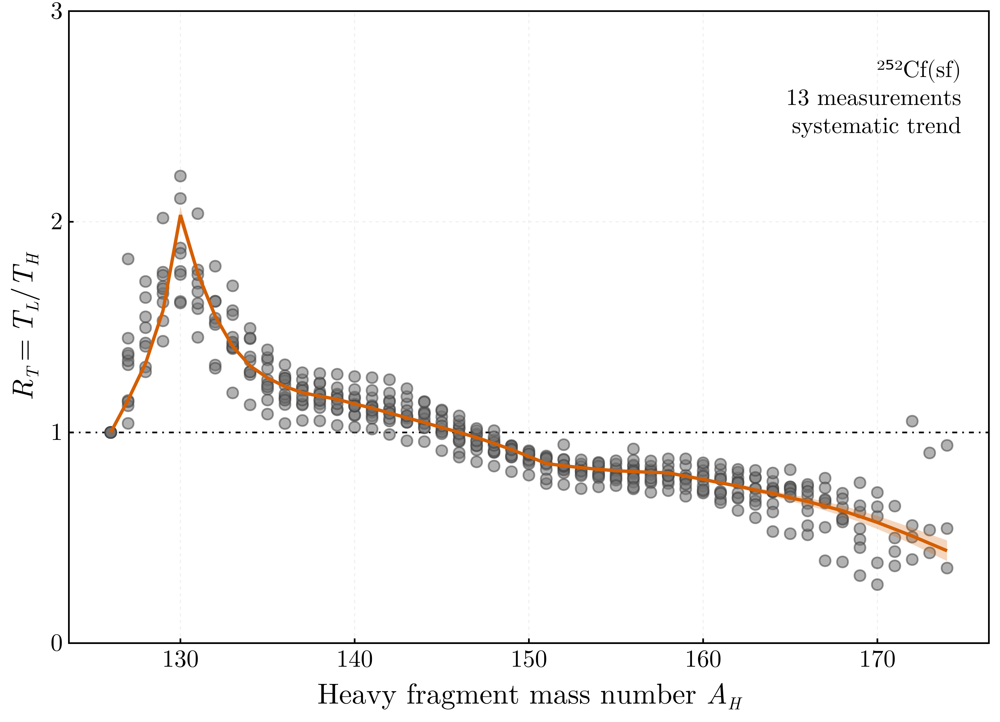
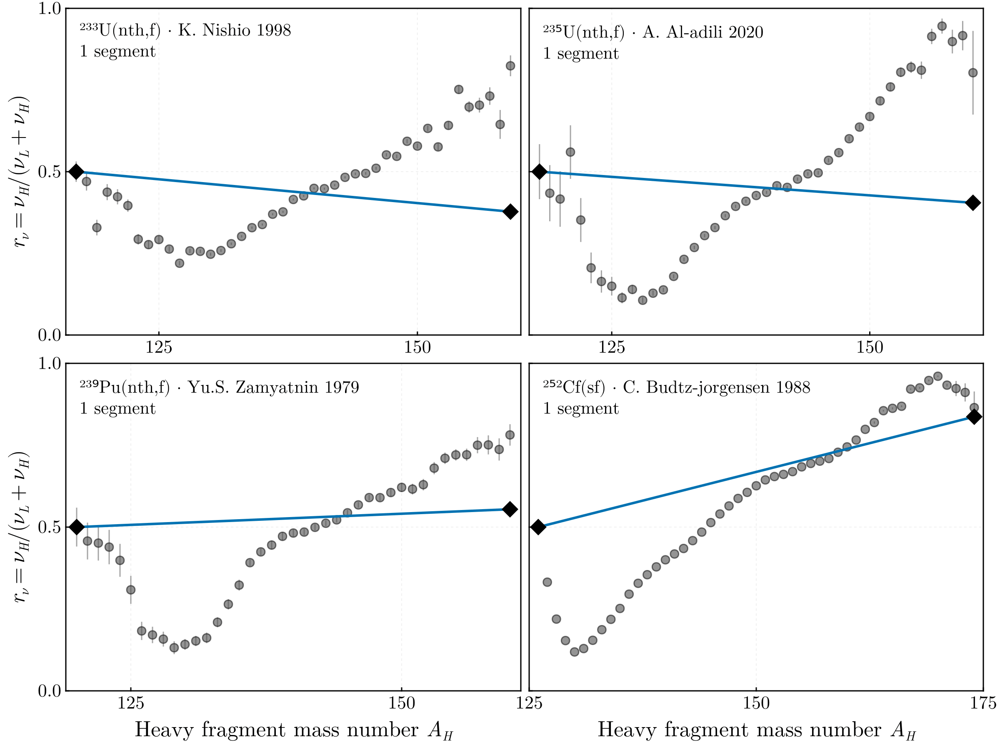
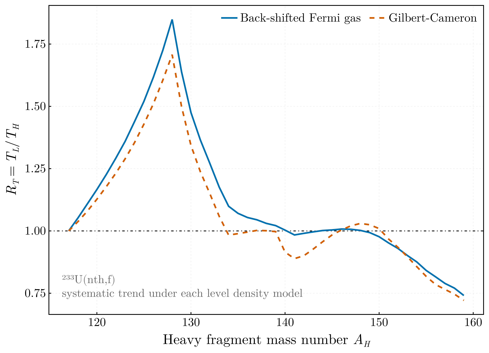
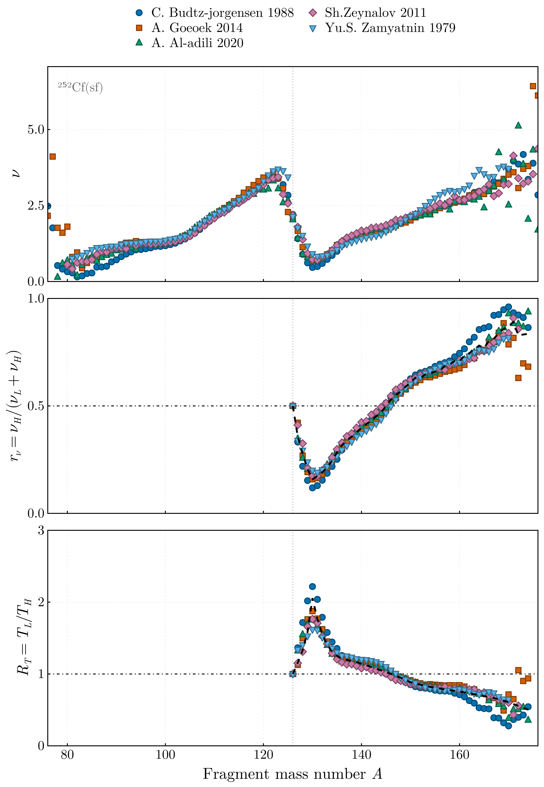
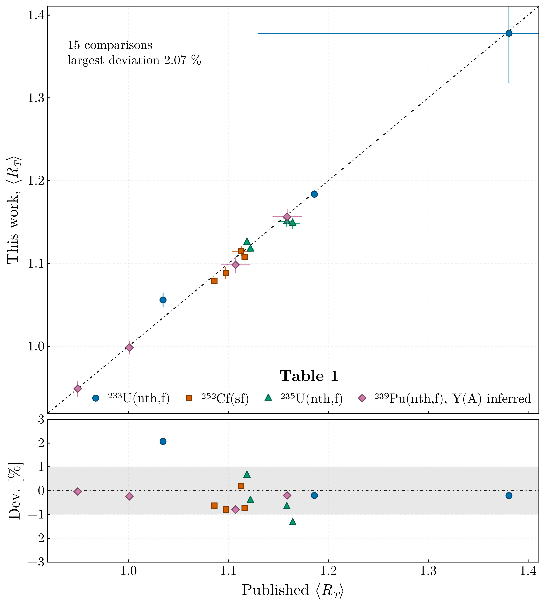

# FissionTemperatureRatio.jl

[](https://github.com/PaulGoG/FissionTemperatureRatio.jl/actions/workflows/CI.yml)
[](https://PaulGoG.github.io/FissionTemperatureRatio.jl/dev/)
[](https://julialang.org)
[](https://github.com/JuliaTesting/Aqua.jl)
[](https://github.com/aviatesk/JET.jl)
[](https://github.com/domluna/JuliaFormatter.jl)
[](LICENSE)

Extraction of the temperature ratio `R_T = T_L/T_H` of complementary fully accelerated fission
fragments from experimental prompt neutron multiplicity data, described by joined straight
segments. The fragmentation domain, the level density parameters and the relation between `R_T`
and the excitation-energy partition are those of
[FissionFragmentsDomain.jl](https://github.com/PaulGoG/FissionFragmentsDomain.jl), which the
prompt emission codes that read `R_T(A_H)` partition on as well.

```
FissionTemperatureRatio/
├── config/          pipeline configurations, one TOML file per fissioning system
├── data/            input data, held locally, README.md on sources and terms; sims/ for run output
├── scripts/run.jl   pipeline entry point, own environment with the plotting stack
├── src/             configuration, inversion, segmented fit and curve, pipeline, provenance
├── ext/             CairoMakie extension: figures
├── test/            test suite, own environment
├── bench/           benchmarks, own environment
├── docs/            Documenter site, own environment, references.bib; assets.jl renders figures
├── formatter/       JuliaFormatter environment used by check.jl
├── check.jl         format, then test
├── activate.jl      activate and instantiate the root environment
└── Project.toml     dependencies and compatibility bounds
```

The full tree is at the [end of this file](#full-file-tree). Generated output is written to
`data/sims/` and `plots/`, neither of which is version-controlled.

## Environments

Each environment carries an activation script that activates and instantiates it silently. The
first instantiation resolves and precompiles, and is slow.

```
julia activate.jl
julia scripts/activate.jl
julia test/activate.jl
julia docs/activate.jl
julia bench/activate.jl
```

Every runnable script activates its own environment as its first statement, so every command
below runs as written, with no project flag. For an interactive session on the package,
`julia -i activate.jl`.

Resolved manifests are not version-controlled: the package supports a range of Julia versions and
a manifest is resolved against one of them, so committing one would break instantiation on the
others. `scripts/run.jl` copies the resolved manifest of the scripts environment into the run
directory as `Manifest.toml`, so a result stays attributable to the exact dependency versions that
produced it.

The formatting environment under `formatter/` is instantiated by `check.jl` and by CI; it is not
one you normally activate by hand.

Each auxiliary environment takes the package through a relative `[sources]` entry, so it runs
against the local source and not a registered snapshot. That key is honoured from Pkg 1.11,
which is the declared floor. The activation scripts resolve before instantiating, because a
dependency added to the package otherwise leaves their manifests stale.

FissionFragmentsDomain.jl is not registered either. Every environment takes it from its repository
at a tagged release through `[sources]`, with the same release as the `[compat]` floor. The
activation scripts fetch it with the git executable (`JULIA_PKG_USE_CLI_GIT`), which honours the
user's git configuration — credentials, `url.insteadOf` rewrites to SSH — where libgit2 can hang.

## Entry points

Run the pipeline for one fissioning nucleus:

```
julia scripts/run.jl config/U233_nth.toml
```

The tables, the manifest and the provenance record go to `data/sims/<system>/<run identifier>/`
and the figures to `plots/<system>/<run identifier>/`; see [the run directory](#the-run-directory).

Run the test suite:

```
julia -e 'include("activate.jl"); using Pkg; Pkg.test()'
```

Apply the formatting gate and then the tests, as CI does:

```
julia check.jl
```

Run the benchmarks:

```
julia bench/benchmarks.jl
```

Build the documentation:

```
julia docs/make.jl
```

Regenerate the figures shown above, from the configuration and the input data:

```
julia docs/assets.jl
```

## Status

| Component | State |
|---|---|
| Mass table, shell corrections, charge distribution, fragmentation domain, level density parameters | FissionFragmentsDomain.jl v0.2.1 |
| Multiplicity ratio | complete |
| Temperature ratio: charge-resolved inversion, excitation-weighted by `⟨TKE⟩(A)` | complete; `⟨TKE⟩(A)` staged for ²³³U |
| Temperature ratio: ratio of means, mean of ratios | complete |
| Retrieval records and reaction-code qualifiers | complete |
| Segmented description with order selection | complete |
| Pipeline, tabulated output, figures, provenance | complete |
| Per-dataset and systematic-trend curves | complete |
| Averaging over a fragment mass yield distribution | complete |
| Reproduction of published total averages | complete for 233-U, 252-Cf and 235-U; see the validation status |
| Run record with the fragmentation domain, for the consuming code | complete |

## Results at a glance

The method, its conventions and its equation numbering are those of *Eur. Phys. J. A* **60**, 190
(2024), [doi:10.1140/epja/s10050-024-01375-7](https://doi.org/10.1140/epja/s10050-024-01375-7),
and this package reproduces the results published there: with the published settings, the total
average temperature ratios of its Tables 1 and 2 come back to within 1.1 % for ²³³U(nth,f),
²⁵²Cf(sf) and ²³⁵U(nth,f), and with the shipped configurations, which invert charge by charge on
Wahl's charge model, Table 1 comes back to within 1.4 %.
The [validation status](#validation-status) below states exactly what has been checked against the
paper and what has not.

Experimental input — prompt neutron multiplicity `ν(A)`, fragment mass yields `Y(A)` and the mean
total kinetic energy `⟨TKE⟩(A)` — comes from the IAEA EXFOR archive through
[ExforFissionData.jl](https://github.com/PaulGoG/ExforFissionData.jl), the supported route, which
retrieves fission observables and writes them as tabulated files with a record of every dataset it
kept or excluded. This package reads those files; it does not query the archive itself.



The temperature ratio of ²⁵²Cf(sf): every measurement held, in grey, and the systematic trend
through them with its uncertainty. Above the symmetric split the light fragment is the hotter of
the pair, and the ratio crosses unity near the most probable fragmentation.



One measurement from each of the four configured systems, fitted with an increasing number of
joined segments. Points carry the uncertainty propagated from the multiplicity data where the
archive quotes one. The breakpoints are not placed by hand: for each order they are searched
exhaustively over the abscissae the data occupies, and the order itself is chosen by the Bayesian
information criterion, which prices every added segment and every added breakpoint. The four
systems do not stop at the same order — five, six, four and five — which is why they are shown
together.

## Figures

The plotting stack is a weak dependency, so `using FissionTemperatureRatio` loads in about a
second and pulls in no graphics. Figures come from an extension that loads with CairoMakie:

```julia
using FissionTemperatureRatio, CairoMakie
```

`scripts/run.jl` runs in the environment under `scripts/`, which carries CairoMakie, so a
pipeline run always writes its figures. A caller using the package as a library gets the tables,
the manifest and `run_metadata` without it, and figures through `write_figures` with it.

## Input data

The input data is not shipped with the package. It is third-party scientific data — experimental
prompt neutron multiplicity, fragment mass yield and kinetic energy measurements — held locally
under the terms of its own sources. `data/README.md` records what each file is and where it comes
from. The atomic mass evaluation, the Gilbert-Cameron shell corrections and Wahl's charge
distribution parameters are FissionFragmentsDomain.jl's, which ships them.

Place it under `data/` in the layout that file describes:

```
data/
└── <system>/                           Cf252_sf, U233_nth, U235_nth, Pu239_nth
    ├── charge_distribution_vs_A.dat    A dZ sigma_Z         (optional)
    ├── nu_vs_A/                        A nu nu_uncertainty, or A nu
    ├── Y_vs_A/                         A Y Y_uncertainty    (optional)
    └── TKE_vs_A/                       A TKE TKE_uncertainty, TKE in MeV, pre-neutron (optional)
```

One directory per system, one subdirectory per measured quantity, one file per measurement: the
directory carries the quantity and the file carries the provenance. A file is named
`<quantity>_vs_<abscissa>`, and an extension states a format and never a nuclide.

The experimental measurements — everything under `nu_vs_A/`, `Y_vs_A/` and `TKE_vs_A/` — come from
[ExforFissionData.jl](https://github.com/PaulGoG/ExforFissionData.jl), the supported source of
`ν(A)`, `Y(A)` and `⟨TKE⟩(A)`, which writes exactly this layout. Run its retrieval from its own checkout, with
the root of this repository as the second argument, the output root:

```
julia scripts/retrieve.jl config/U233_nth_nu_vs_A.toml /path/to/FissionTemperatureRatio
```

Each directory also holds the `retrieval.toml` run record naming every dataset the query kept or
excluded, and every file name carries its EXFOR DatasetID, so a result traces back to an archive
entry. A DatasetID has eight digits, or nine where it points within a subentry; the dataset label
drops the leading digits either way, and two files of one author and year keep their DatasetID in
parentheses so that labels stay unique. Files other than `.dat` in those directories are ignored
by the readers, so the run record sits beside the data it describes.

The run record also lists the reaction-code qualifiers of every dataset. A dataset carrying
`DERIV` (derived from other data) or `SPA` (averaged over an unspecified neutron spectrum) is used,
not corrected, and flagged: in the log, in the `qualifiers` and `flagged` columns of
`dataset_diagnostics.csv`, and in the run metadata. A `⟨TKE⟩(A)` dataset is accepted only if a run
record beside it lists it, and its record — the parser revision that wrote it, the entry, a
SHA-1 of the whole record — goes into the run metadata.

A multiplicity file is `A nu nu_uncertainty`, or `A nu` where the measurement quotes no
uncertainty. An absent, non-numeric or non-positive uncertainty is read as `missing`, never as
zero, which would denote an exact value.

Readers take columns **by position**, not by header text, so a header rename upstream is a no-op
here. `docs/src/naming.md` sets out the vocabulary — quantities, identifiers, configuration keys,
file names and headers — that this package and the codes on either side of it share.

Without the data the pipeline cannot run, and the tests that need measurements are skipped with a
warning. The rest of the suite — the inversion on the shipped fragmentation domains, the
configuration, a synthetic run and its run record — runs regardless, on the mass table and shell corrections
FissionFragmentsDomain.jl ships.

## Configuration

Every run is driven by a TOML file under `config/`, which fixes the fissioning nucleus, the
fragmentation range, the level density model, the segment search and the precision of the
tabulated output. The parser enforces the types, enumerated choices and bounds its comments
document, refuses unknown sections and keys, and fails naming the offending key, so a run cannot
start from a configuration it cannot honour.

A system is declared by what was irradiated, not by what fissions: the target, the entrance
channel and the incident energy. The reaction code, the fissioning nucleus and the system label
`<symbol><A>_<channel>` — `Cf252_sf`, `U235_nth` — are all **derived** from them, so a label
cannot contradict the nuclide it names, and two incident energies of the same target are two
systems rather than one: they share a label but not a run identifier. The channel is also what
separates a thermal run from a resonance run of the same target, which the reaction code `n,f`
alone cannot.

To add a fissioning system, place its ν(A) datasets in `data/<system>/nu_vs_A/` as
whitespace-separated `A nu nu_uncertainty` or `A nu` tables with one header line, and copy a
configuration to `config/<system>.toml`.

### Fragmentation domain and inversion

```toml
[fragmentation]
charges_per_mass = 5                   # odd, 1 to 15
heavy_mass_min = 117                   # at least A0/2
heavy_mass_max = 159                   # below A0
charge_distribution_file = "wahl"      # "wahl" | "mean", or a table A dZ sigma_Z under data/
zero_polarization_at_symmetry = false  # dZ = 0 at A0/2 for a table or "mean"

[level_density]
model = "BSFG"                         # "BSFG" | "GC"
mass_excess_file = "ame2020"           # the evaluation FissionFragmentsDomain.jl ships, or a table
shell_correction_file = "gilbert_cameron_1965"  # Table III as FissionFragmentsDomain.jl ships it, or a table
deformed_branch = true                 # "GC": eqs. (20) and (21); false for eq. (20) throughout
ratio_averaging = "charge_resolved"    # "charge_resolved" | "ratio_of_means" | "mean_of_ratios"
mean_kinetic_energy_file = "U233_nth/TKE_vs_A/21981008_P.Geltenbort_1985.dat"
```

The fragmentation domain is built by FissionFragmentsDomain.jl from these keys; `"wahl"` resolves
Wahl's `Zₚ` model for the system, with the 1988 per-reaction parameters for the four shipped
systems. `ratio_averaging = "charge_resolved"`, the default, solves for `R_T` in the relation
between `R_T` and `E*_H/TXE` reduced over the charge distribution fragmentation by fragmentation —
the exact inverse of a prompt emission code that partitions every pair with its own `a_L/a_H` —
and `mean_kinetic_energy_file` weights every fragmentation by its mean total excitation
`Q + E*_CN - ⟨TKE⟩(A_H)`. Where the dataset gives both `A` and `A₀ − A`, the pair takes the mean
of the two, `⟨TKE⟩` being one value per split; its yield-weighted mean and the offset from the
energy standard of the system (Gönnenwein's recommendations, as FissionFragmentsDomain.jl records
them) are logged and written to `metadata.toml`. The approved sets are Göök 2014 for ²⁵²Cf,
Al-Adili 2016 for ²³⁵U, Wagemans 1984 for ²³⁹Pu and Geltenbort 1985 for ²³³U; the shipped
configurations name the ²³³U one, the others once their retrievals are staged. Without that key
the weights are `p(Z, A_H)` alone, and the run says so.
`"ratio_of_means"` is the closed form of the published extraction. The published settings are
reproduced exactly by `ratio_of_means` over the digitised charge tables with
`zero_polarization_at_symmetry = true`, or over `"mean"` for 233-U; see
[the method](docs/src/method.md) for why the default changed.

### Several measurements of one system

Datasets are never merged. Each is fitted on its own, and a further curve — the systematic trend
— is fitted to all of them combined. They are alternatives offered to a prompt emission code, not
an ensemble to be averaged; which one describes reality is settled downstream, by comparing the
multiplicity distributions and yields that code produces against experiment.

The datasets of one system disagree far beyond their quoted uncertainties: for 252-Cf the spread
between them at a given mass number runs to ten or twenty times the median quoted uncertainty. Two
consequences shape what the package does.

**How several measurements become one result — and where they do not.** Each dataset is carried
through the whole chain on its own: its own `r_ν`, its own segmented fit, its own `R_T`, its own
total average. Those are never merged. What a run offers is one curve per measurement that reaches
the coverage floor plus one more, the systematic trend, and a consuming code takes exactly one of
them.

The trend is the only place the measurements are combined, and the combination happens at the
level of `r_ν`, before any fitting: at each mass number the values from every admitted dataset are
merged into one, and the segmented fit is then run on that single combined curve. So the ordering
is combine-then-fit, not fit-then-average.

**Pooling.** The combined curve cannot be a concatenation weighted by the quoted uncertainties —
that hands the result to whichever author quoted the smallest ones, and counts a dataset with many
points more heavily than one with few. The datasets are combined mass number by mass number with
an additional between-dataset variance, so the weights become nearly equal and the uncertainty of
the combination reflects the disagreement instead of hiding it. The combined curve is written out,
so the trend can be checked against its own input.

**Admission.** For the same reason, a dataset cannot be judged by how far it sits from the others
in units of its own uncertainty: none is consistent with any other, and a reduced chi-squared
ranks how generously an author quoted errors rather than how good the measurement is. Every
dataset is therefore described by structural diagnostics instead — usable fragment pairs and the
span they cover, points outside the physical range, the departure from one half at the symmetric
split, and `ν(A) + ν(A₀-A)` against the total multiplicity — written to `dataset_diagnostics.csv`
for every dataset whether or not it was used, with a last column stating whether it offers a
segmented curve and, if not, why.

The archive itself is the first filter: the retrieval rejects datasets whose reaction code or
units say they are not the quantity asked for, and records why. The diagnostics here are the
second, structural filter, and they do catch sloppy data — for 252-Cf the complementary sums
separate cleanly into sets consistent with the total multiplicity of 3.76 (Alkhazov 3.75, Mehta
3.72, Budtz-Jørgensen 3.70, Vorobiev 3.83) and sets a tenth high (Basova 4.27, Zamyatnin 4.21,
Ding Shengyao 4.18, Göök 4.17), which is a normalization discrepancy rather than a measurement
one.

Nothing is filtered automatically. A dataset is kept out of the pooling only when the
configuration names it and says why:

```toml
[multiplicity]
subdirectory = "Cf252_sf/nu_vs_A"
exclude = [
    { dataset = "E. Nardi 1968", reason = "one usable fragment pair in range" },
]
```

An excluded dataset is still read, still fitted where its coverage allows, still written and still
diagnosed. It is excluded from the combination, not from the record.

Two guards bound what a segmented curve may assert. `min_segment_span` (an integer from 1 to 50,
default 3) is the smallest extent of a segment in mass units from its first pivot to its last; at
four points per segment on consecutive mass numbers it coincides with the point guard
`min_points_per_segment`, so it acts where abscissae repeat or the point count is set lower.
`min_dataset_coverage` (a real from 0 to 1, default 0.3) is the fraction of the mass numbers of the
fragmentation range at which a dataset must provide a complete pair to be offered as a segmented
curve of its own. Below it the dataset is read, diagnosed and pooled into the trend, but no curve
is fitted to it alone: with pairs at few mass numbers the breakpoint search cannot place the
minimum where the data do not reach, and the curve it returns asserts structure between the
measurements that a consuming code could not tell from a measured feature. All four shipped
configurations set both explicitly. The number of segments itself is chosen by the Bayesian
information criterion as published. `required_windows` places a breakpoint where physics says
there is one — the minimum at the heavy magic fragment, `A_H` near 130, fixed by the `Z = 50`,
`N = 82` shell closure — and `windows_apply_to_datasets` extends that from the trend curve to every
dataset.

The `[yield]` section is optional. Given a directory of pre-neutron mass yield distributions, the
run also reports the total average `⟨R_T⟩ = Σ Y(A_H) R_T(A_H) / Σ Y(A_H)` for every combination of
segmented curve and distribution — the quantity the literature tabulates, and the one a prompt
emission code takes when it uses a single temperature ratio for all fragmentations. Each carries
two uncertainties: the fit covariance propagated through the average, and beside it the
independent-points form of the published tables, which treats the tabulated points as uncorrelated
and understates the uncertainty by a factor of two to five. Without yields the run reports only the
mean over the fragment mass range, with the covariance propagated likewise; it weights every mass
number equally and is therefore dominated by the far-asymmetric tail. The normalization of `Y`
cancels. `symmetrize = true`, the default, imposes the pre-neutron identity `Y(A) = Y(A₀ − A)`
before averaging: the two fragments of a split are one event, so where a distribution is measured
on both wings each mass takes the mean of the two. The published averages took the distributions as
measured, `symmetrize = false`.

Two level density models are available. The back-shifted Fermi gas is the default; setting
`model = "GC"` selects Gilbert-Cameron, which for fission fragments returns markedly larger
parameters away from closed shells, with its deformed-nucleus formula where the 1965 paper
prescribes it unless `deformed_branch = false`. Running both bounds a systematic uncertainty that
the propagated experimental uncertainties do not cover.



The two agree exactly at the symmetric split, where the identity of the fragments forces the ratio
to one whatever the model, and part across the shell region. Gilbert-Cameron was
superseded by the back-shifted Fermi gas, so the spread between them is an upper bound on the
systematic rather than a symmetric error bar.

## The run directory

`run_pipeline(configuration)` returns an `ExtractionResult` and writes nothing.
`write_results(result, directory)` writes the tables and the manifest into `directory` and refuses
one that already holds files. `scripts/run.jl` names that directory
`data/sims/<system>/<run identifier>/`; an existing directory of the same name is moved aside as
`<run identifier>#1`, `#2`, …, so the earlier run takes the suffix and none is overwritten. The
script then writes the figures to `plots/<system>/<run identifier>/` through
`write_figures(result, directory)`, and the provenance record `metadata.toml`: the library's
`run_metadata(result)`, the identifier, the configuration and script paths, a timestamp, the git
commit through DrWatson's `tag!`, and the platform — Julia version, hostname, kernel, machine, CPU
model and threads, Julia and BLAS threads, memory, and `versioninfo()`. Beside it go copies of the
configuration, as `configuration.toml`, and of the resolved manifest of the scripts environment, as
`Manifest.toml`.

| File | Content |
|---|---|
| `manifest_<run identifier>.toml` | the run record a consuming code reads; exactly one per directory |
| `r_nu_vs_A_H_<dataset>.csv`, `R_T_vs_A_H_<dataset>.csv` | the ratios extracted point by point from one measurement |
| `r_nu_vs_A_H_consensus_systematic_trend.csv` | the combined ratio the trend curve was fitted to |
| `r_nu_vs_A_H_segmented_<label>.csv`, `R_T_vs_A_H_segmented_<label>.csv` | the fitted ratio at every mass number and the temperature ratio from it |
| `r_nu_vs_A_H_pivots_<label>.csv` | the fit as its joined points |
| `segmented_curves_<run identifier>.csv` | one row per manifest curve, keyed by its label: segments, pin, span, pairs, coverage, reduced chi-squared, range mean |
| `total_average_R_T_<run identifier>.csv` | `⟨R_T⟩` of every segmented curve over every yield distribution |
| `dataset_diagnostics.csv` | one row per dataset read, with its reaction-code qualifiers |
| `metadata.toml`, `configuration.toml`, `Manifest.toml` | the provenance record, written by the script |

The manifest, the curve table and the total averages carry the run identifier in their names;
every other table is named by its quantity, its abscissa and its label, and found through the
manifest. `write_results` refuses a run whose identifier would make one of those names longer than
the 255 bytes a file system admits. The ratio tables have the headers `A_H,r_nu,r_nu_uncertainty`
and `A_H,R_T,R_T_uncertainty`, the pivot table included; in the point-by-point tables an
uncertainty the measurement does not quote is an empty field, never zero.
`segmented_curves_<run identifier>.csv` has the columns `label, kind, pooled, segments,
pinned_at_symmetric_split, first_A_H, last_A_H, pairs, coverage, reduced_chi_squared,
weights_imputed, range_mean_R_T, range_mean_R_T_uncertainty`, all dimensionless.
`total_average_R_T_<run identifier>.csv` has the columns `segmented_curve, mass_yield, R_T, R_T_uncertainty,
R_T_uncertainty_independent_points`, and
`dataset_diagnostics.csv` the columns `dataset, points, pairs, first_pair, last_pair, coverage,
outside_physical_range, symmetry_departure, complement_sum, complement_spread,
without_uncertainties, qualifiers, flagged, pooled, exclusion_reason, segmented_curve`, the last
reading "segmented
curve" or stating why there is none: no complete pair, coverage below the floor, or no fit and the
reason. The figures are `nu_vs_A.pdf`, `r_nu_vs_A_H.pdf` and `R_T_vs_A_H.pdf`, and
`r_nu_vs_A_H_segmented_<label>.pdf` and `R_T_vs_A_H_segmented_<label>.pdf` for every dataset curve.

The run identifier is DrWatson's `savename` over every configuration key that changes the result,
tokens sorted and joined by `_`, each key abbreviated through `RUN_IDENTIFIER_ABBREVIATIONS`, which
is keyed by the key's dotted path in the configuration file. The system is not a token, since it
names the directory the identifier sits in, and neither is `significant_digits`, which changes
rendering and not the number. A list or a path — the required windows, the exclusion list, a
tabulated charge distribution, a mass or shell-correction table, the `⟨TKE⟩(A)` dataset, the yield
directory — enters as the first eight hexadecimal digits of
the SHA-1 of its canonical spelling, paths relative to the data directory, and is written in full
into `metadata.toml` under `[identifier.hashed]`; a shipped table enters by name, Table III as
`gc1965`. The Gilbert-Cameron branch and shell corrections are tokens of a Gilbert-Cameron run
only. The identifier stays short enough for the file names that repeat it to fit the 255 bytes a
file system admits, which the test suite checks for every shipped configuration under both level
density models. For 233-U:

```
AHmax=159_AHmin=117_E=2.53e-8_TKE=a1ad68dc_Y=ab535eba_Ysym=true_avg=charge_resolved_chg=wahl_cov=0.3_dZ0=false_excl=da39a3ee_ldm=BSFG_mass=ame2020_nZ=5_npts=4_nseg=6_pin=true_span=3_wdat=false_win=b552f081
```

## Consuming the output

The manifest is the entry point for a code that takes these curves as input, and it is meant to
be read rather than parsed out of file names. It is FissionFragmentsDomain.jl's run record,
written by its `write_temperature_ratio_manifest` and read by its
`read_temperature_ratio_manifest`, and holds nothing else. To stage a run, copy the whole run
directory from `data/sims/<system>/<run identifier>/`; it holds exactly one `manifest_*.toml`,
which `staged_manifest` selects by that prefix. An abridged 233-U manifest:

```toml
[system]
label = "U233_nth"
notation = "²³³U(nth,f)"
target_A = 233
target_Z = 92
channel = "nth"
reaction = "n,f"
incident_energy_MeV = 2.53e-8
compound_A = 234
compound_Z = 92

[run]
ordinate = "R_T"
abscissa = ["A_H"]
columns = ["A_H", "R_T", "R_T_uncertainty"]

[domain]
level_density_model = "BSFG"
deformed_branch = false
ratio_averaging = "charge_resolved"
excitation_weighted = true
charges_per_mass = 5
charge_model = "Wahl1988(U233T, Z_F = 92, A_F = 234)"
mass_table = "mass_excess_ame2020.dat"
package_version = "0.2.1"

[[segmented_curve]]
label = "K. Nishio 1998"
kind = "dataset"                   # or "systematic_trend"
temperature_ratio_file = "R_T_vs_A_H_segmented_K._Nishio_1998.csv"
multiplicity_ratio_pivots_file = "r_nu_vs_A_H_pivots_K._Nishio_1998.csv"

[[segmented_curve]]
label = "systematic_trend"
kind = "systematic_trend"
temperature_ratio_file = "R_T_vs_A_H_segmented_systematic_trend.csv"
multiplicity_ratio_pivots_file = "r_nu_vs_A_H_pivots_systematic_trend.csv"
```

What else the run reports about each curve is in `segmented_curves_<run identifier>.csv`, one row
per manifest curve keyed by the same label, and in `metadata.toml`.

Four things worth knowing before writing against it.

**The domain must match.** `[domain]` records the fragmentation domain the curves were extracted
on: the level density model and its Gilbert-Cameron branch, the averaging and its excitation
weighting, the charges per mass, the charge model, the mass table and the version of
FissionFragmentsDomain.jl. A code that partitions the excitation energy on another domain does not
invert the same relation, and DeterministicSequentialEmission.jl refuses such a curve.

**Read the columns by position, and read `temperature_ratio_file`.** `columns` says what the three
columns hold; it is not there to be matched against the header text. `R_T` is not piecewise-linear
even where the multiplicity ratio is, because the level density parameters carry the shell
structure into it, so it is tabulated at every mass number and whatever interpolation a consumer
applies reproduces the tabulated value; the pivot file holds `r_ν`, not `R_T`. The tabulated
`R_T_uncertainty` is the square root of the diagonal of the propagated covariance of the curve;
the tabulated points are not independent, so summing their uncertainties in quadrature understates
the uncertainty of any average over them. `total_average_R_T_<run identifier>.csv` carries the
covariance-propagated uncertainty of each total average first and the independent-points one
beside it.

**The curves are alternatives, not an ensemble.** Take one. Which one describes reality is settled
by running your code with each and comparing what it produces against experiment; that is what
they are for. `kind = "systematic_trend"`, labelled `systematic_trend`, is the one to take where a
dataset is too sparse or too scattered to resolve the shape.

**The default inverts a per-pair partition exactly.** A code that forms `a_L/a_H` for every
fragmentation `(A_H, Z_H)` and applies `R_T(A_H)` to each recovers the measured `r_ν(A_H)` to
rounding from a `charge_resolved` curve, and from an excitation-weighted one when it weights the
pairs by their excitation as the measured multiplicities do. A `ratio_of_means` curve, the
published setting, misses that round trip by up to 4 × 10⁻³ in `R_T` at the doubly magic heavy
fragment.

`test/test_manifest.jl` is a consumer: it reads a run through FissionFragmentsDomain.jl's reader
and nothing else, and checks the contract this section describes.

## Method

For each fragment pair the prompt neutron multiplicity ratio is identified with the excitation
energy ratio, and the fragment level densities are taken in the Fermi-gas regime, so that one
fragmentation with `ρ = a_L/a_H` gives the heavy fragment `E*_H/TXE = 1/(1 + ρ R_T²)`. The
measured `r_ν = ν_H/(ν_L + ν_H)` is resolved by mass alone, and `R_T(A_H)` is the root of

```
r_ν(A_H) = Σ_Z p(Z, A_H) ⟨TXE⟩_Z / (1 + ρ_Z R_T²)  /  Σ_Z p(Z, A_H) ⟨TXE⟩_Z,
```

with `⟨TXE⟩_Z = Q(A_H, Z) + E*_CN − ⟨TKE⟩(A_H)`, which involves no fit and no prompt emission
calculation. With one effective ratio `R_a` in place of `ρ_Z` it reduces to the closed form
`R_T = [(1 - r_ν)/(R_a r_ν)]^(1/2)` of the published method. Because the ratio extracted point by
point is scattered, it is `r_ν` that is described by a continuous piecewise-linear function whose
segment count and breakpoints are selected from the data by the Bayesian information criterion,
and `R_T` follows by the inversion above.

Constraints that are exact are enforced rather than fitted: `r_ν` is pinned to one half at the
symmetric split, for every curve whose data reach it, and the fitted curve may not leave `(0, 1)`,
outside which the relation is undefined. Wahl's charge model has no polarization at the symmetric
split, so the charges retained there are their own mirror, and `R_T(A₀/2) = 1` follows exactly, as
an outcome rather than an imposition.

A run produces one segmented curve per experimental dataset, plus a systematic-trend curve fitted
through all of them with the minimum at the heavy magic fragment placed rather than fitted. These
are alternatives for a prompt emission code to choose between, not an ensemble to be averaged: the
datasets of one fissioning nucleus can disagree well beyond their quoted
uncertainties, and which curve describes reality is settled downstream, by comparing the
multiplicity distributions and yields the code produces against experiment.



From the measured sawtooth to the temperature ratio, on a shared abscissa: the multiplicity of each
fragment of the pair, the ratio formed from them, and the temperature ratio that follows by the
exact inversion. No fit and no prompt emission calculation enters any step.

`docs/src/method.md` sets this out in full, with references, including why the charge-resolved
inversion replaced the ratio of means as the default.

## Validation status

What has been checked, and what has not. Stated explicitly because the method is published and a
reader's first question is whether this reproduces it.

Verified:

- The exact identity at the symmetric split. `r_ν = 1/2` returns `R_T = 1` to 10⁻¹² on the four
  shipped domains, weighted and unweighted, as an outcome of the construction rather than an
  imposition, and a run reports it if it does not.
- The round trip with the consumer's partition. For every heavy mass of the ²⁵²Cf and ²³⁵U domains
  and `R_T` of 0.8, 1 and 1.45, the extraction returns `R_T` from the `E*_H/TXE` the shared forward
  relation gives, to a relative 10⁻¹², weighted and unweighted; with one charge per mass all three
  averagings reduce to the closed form. The uncertainty propagates with the slope of the inversion,
  checked against a finite difference, and the fitted curve is continuous at every breakpoint and
  stays inside the physical range.
- The shell structure. The level density parameter is suppressed threefold at the doubly magic
  heavy fragment relative to a mid-shell fragment, which is what gives `R_a(A_H)` its structure.
- The shape of the result. The segmented `r_ν(A_H)` reproduces the published systematic
  behaviour — one half at the symmetric split, a minimum near the heavy magic fragment, one half
  again near the most probable fragmentation, and a near-linear rise above it.
- **The published total averages, to within 1.1 %.** The `⟨R_T⟩` of Table 1 of the
  paper, per `ν(A)` dataset and per `Y(A)` distribution, comes back from independently retrieved
  archive data with the published settings — the ratio of means over the digitised Gaussian charge
  tables, or the mean values for ²³³U, on the shared fragmentation domain:

  | System | `Y(A)` | Datasets compared | Largest deviation, published settings | Largest deviation, shipped configuration |
  |---|---|---|---|---|
  | ²³³U(nth,f) | Surin | 3 of 3 | 1.09 % | 1.36 % |
  | ²⁵²Cf(sf) | Göök | 4 of 5 | 0.55 % | 0.51 % |
  | ²³⁵U(nth,f) | Al-Adili, Straede | 2 of 3 | 1.00 % | 1.01 % |

  

  The figure shows the shipped configurations.

  The 1.09 % is Fraser's 233-U set, which quotes no uncertainties, has fifteen usable fragment
  pairs, and carries ±0.25 in the published table; the other two 233-U rows are within 0.60 %.
  The shipped configurations — Wahl's 1988 charge model and the charge-resolved inversion, weighted
  by Geltenbort's `⟨TKE⟩(A)` for ²³³U — hold every row to the same tolerances, to within 1.36 % (Fraser)
  and 1.01 % for the rest. Wahl's model moves the ²³³U rows by +0.28 % to +0.43 % from the mean
  values the paper used there, and the rows of the other systems by less than 0.1 %.

  Table 2 reproduces too: the Gilbert-Cameron variant to 0.21 %, and the one-charge-per-mass
  variant to 0.80 %. The remaining datasets could not be compared because the archive query did
  not return the `ν(A)` measurement the table names.
- The uncertainty of the total average. The independent-points uncertainty reproduces the
  published one, ±0.0020 against ±0.0021 for ²³³U Nishio over Surin, and the
  covariance-propagated uncertainty is ±0.0050, two and a half times larger, because the tabulated
  points of a fitted curve are not independent. For the sparse Fraser ²³³U set the
  covariance-propagated ±0.23 matches the published ±0.25, where the independent-points ±0.17 does
  not.
- The suite passes on the declared Julia floor and on the current release.
- The level density models, against their papers: the back-shifted Fermi gas coefficients, shell
  correction, pairing term and liquid-drop coefficients of Phys. Rev. C **72**, 044311 (2005) and
  **80**, 054310 (2009), and the Gilbert-Cameron eqs. (20) and (21) with Table III of
  Can. J. Phys. **43**, 1446 (1965). Both are FissionFragmentsDomain.jl's, which ships the table
  and tests the transcription; this package's own implementations, checked against the same
  sources before they were retired, give the same total averages to 5 × 10⁻⁶ under the published
  settings.

Not verified:

- **²³⁹Pu(nth,f) is reproduced only in part.** The published table averages over a yield
  distribution its caption does not name, and over a second that is calculated and cannot be
  retrieved. With the Nishio 1995 `Y(A)`, the Nishio `ν(A)` row comes back to 0.09 % and Fraser to
  0.7 %, but Apalin and Zamyatnin deviate by 2.0 % and 2.1 %, so the identification of the yield
  distribution stays open.
- The excitation weight in the shipped runs of ²⁵²Cf, ²³⁵U and ²³⁹Pu. Their `⟨TKE⟩(A)` retrievals
  are not yet staged, so those runs weight by `p(Z, A_H)` alone. With the approved sets the weight
  moves `R_T` by 7 × 10⁻³ to 1.1 × 10⁻² at `A_H = 130` in all four systems, and `⟨R_T⟩` by −0.03 %
  to −0.15 %, every Table 1 row staying within its tolerance.
- The effect of neglecting the back-shift. The level density parameter is taken from a systematic
  that fits it jointly with a back-shift `E1`, while the extraction rests on the un-shifted
  `E* = a T²` the method is published under. `E1` differs between the two fragments, so it does not
  cancel in the ratio; at order ±1 MeV against fragment excitations of 10-20 MeV the effect is
  expected to be small, but it has not been quantified.
- The path for a fissioning nucleus of odd mass number is covered only by unit tests; no such case
  exists in the data.

## How to cite

FissionTemperatureRatio.jl is written by Paul-Adrian Gogîță. For the method, cite
*Eur. Phys. J. A* **60**, 190 (2024),
[https://doi.org/10.1140/epja/s10050-024-01375-7](https://doi.org/10.1140/epja/s10050-024-01375-7);
for the implementation, cite this repository by its URL,
<https://github.com/PaulGoG/FissionTemperatureRatio.jl>.

## Licensing

The source code is under the MIT licence in `LICENSE`.

That licence does not extend to the contents of `data/`, none of which originates with this
package. The atomic mass evaluation, the charge distribution systematics, the shell corrections
and every prompt neutron multiplicity and fragment mass yield measurement are third-party
scientific data, held locally and not redistributed here — `data/` carries only its own README.
That file records what each input is, where it came from and how it should be cited; any result
derived from a measurement should cite that measurement.

## Full file tree

<details>
<summary>Every tracked directory and entry file</summary>

```
FissionTemperatureRatio/
├── .github/                        continuous integration and dependency updates
│   ├── dependabot.yml
│   └── workflows/                  CI.yml (tests, docs) and format.yml (formatting gate)
├── .JuliaFormatter.toml            formatting rules, enforced by check.jl and CI
├── activate.jl                     activate and instantiate the root environment
├── CHANGELOG.md                    notable changes
├── check.jl                        pre-commit: format, then test
├── LICENSE                         MIT, covering the source code only
├── Project.toml                    dependencies and compatibility bounds
├── bench/                          benchmark suite, own environment
│   ├── activate.jl
│   ├── benchmarks.jl
│   └── Project.toml
├── config/                         pipeline configurations, one per fissioning system
│   ├── Cf252_sf.toml
│   ├── Pu239_nth.toml
│   ├── U233_nth.toml
│   └── U235_nth.toml
├── data/                           input data, held locally and not version-controlled
│   ├── README.md                   what each input file is, where it comes from, its terms
│   └── sims/                       run output, data/sims/<system>/<run identifier>/
├── docs/                           Documenter site, own environment
│   ├── activate.jl
│   ├── assets.jl                   regenerates the figures the README shows
│   ├── make.jl
│   ├── Project.toml
│   └── src/                        index, method, naming, reference, references; assets/ for figures
│       └── references.bib          DOI-keyed bibliography of the method page
├── ext/                            weak-dependency extensions
│   └── FissionTemperatureRatioCairoMakieExt.jl   publication figures, loaded with CairoMakie
├── formatter/                      JuliaFormatter environment, version-bounded
│   ├── activate.jl
│   └── Project.toml
├── scripts/                        pipeline entry point, own environment
│   ├── activate.jl
│   ├── Project.toml
│   └── run.jl                      pipeline entry point
├── src/
│   ├── configuration.jl            TOML configuration, parsed and validated; model builders
│   ├── consensus.jl                combining datasets, and the diagnostics describing them
│   ├── extracted_curve.jl          one extracted curve: fit, R_T, covariance; its averages
│   ├── FissionTemperatureRatio.jl  module definition and public interface
│   ├── kinetic_energy.jl           ⟨TKE⟩(A) onto the heavy-mass range; retrieval records
│   ├── multiplicity_ratio.jl       ν(A) input and the multiplicity ratio
│   ├── pipeline.jl                 the run, from input to tabulated output and run record
│   ├── plotting.jl                 figure interface; the implementation is in ext/
│   ├── provenance.jl               run identification and metadata
│   ├── segmented_fit.jl            continuous piecewise-linear regression
│   ├── temperature_ratio.jl        the inversion over a tabulated r_ν
│   └── yields.jl                   Y(A) directories and the independent-points total average
└── test/                           test suite, own environment
```

</details>
